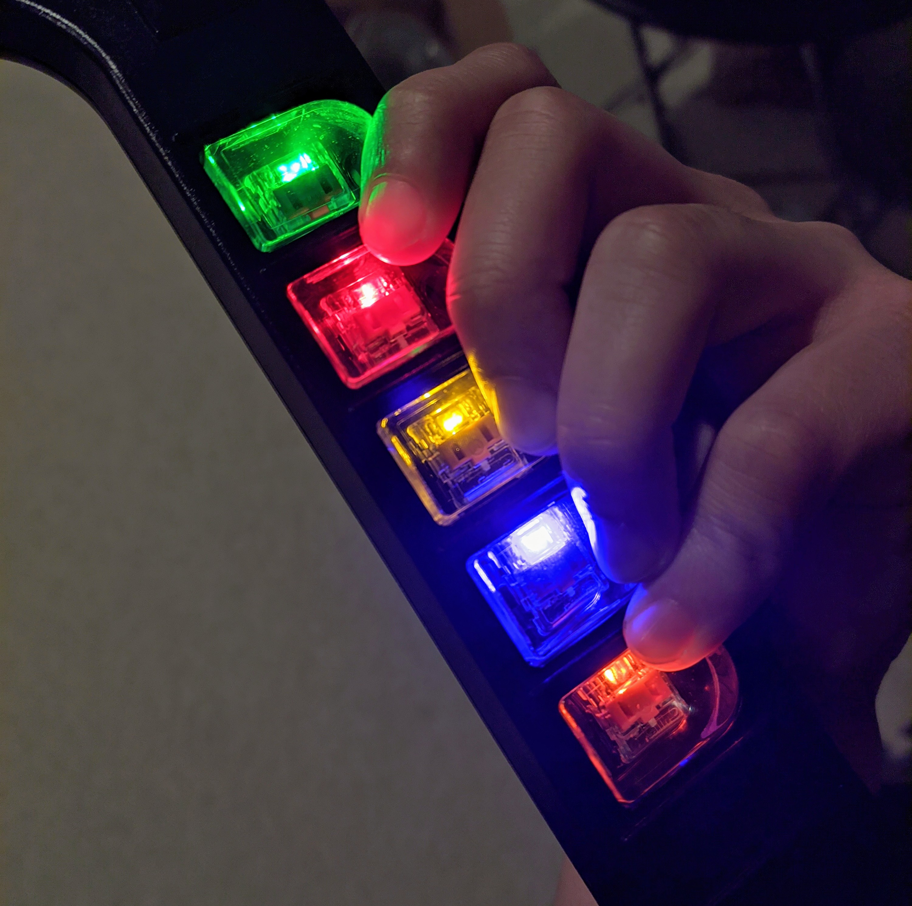

# Adding Standard LEDs inline on a controller
If you want to avoid the trouble of using APA102s, and just want to hook up normal LEDs from buttons, you can follow the following guide.
## You will need
* A Directly wired controller
* Some LEDs
* a 500 ohm resistor for each led

## The finished product

## Steps
1. Hook your frets up with a common positive pin instead of a common ground
1. Put each led inline with the frets
1. Hook the leds up to the digital pins you are using, with a 500 ohm resistor pulling each pin down to ground.
1. Open the Config Tool and find your device, then click continue
1. Click on Configure LEDs
1. Set the LED type to Inline
2. Click on Close
3. Click on Write