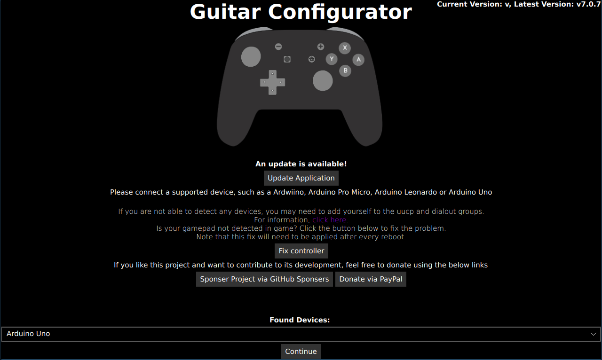

# Building an Adaptor for a PS2 Controller
## You will need
* One of the following Arduinos:
  * Pi Pico (I recommend this the most, as it is the easiest to get started with and for most people it will be easier to purchase, and it runs at 3.3v so it works for everything.)
  * Arduino Pro Micro (3.3v)
  * With the following devices, you will need the following level shifter: https://learn.sparkfun.com/tutorials/bi-directional-logic-level-converter-hookup-guide/all
    * Arduino Leonardo
    * Arduino Micro
    * Arduino Uno
    * Arduino Mega
    * You can also use a 5v Pro Micro, but you will also need a 3.3v voltage regulator
```danger
  The arduino nano is NOT supported as it does not have the necessary hardware onboard for emulating a usb device. Some very very cheap arduino unos will also have this problem as they replace the programmable usb controller with a non programmable serial adapter. I don't recommend UNOs at all, but if your arduino uno mentions anything about a ch340g it won't work.
```
* PS2 Controller socket or some male dupont wires
* 2x 1kΩ Resistor
* Some Wire
* A Soldering Iron

```note
If you are unsure what microcontroller you want to use, click [here](https://sanjay900.github.io/guitar-configurator/guides/micro-controller-comparison.html) for a list of pros and cons about each microcontroller.
```
```danger
Be careful that you don't ever provide 5v power to any pins on the PS2 Controller. While some people have done this successfully and just use their controllers with 5v, I can't recommend this approach as the controllers are really designed for 3.3v, so it may damage them slowly over time.
```

```danger
Be careful when programming an Arduino that has multiple variants. If you pick the wrong voltage, your device won't show up and you will need to follow the [rescuing](https://sanjay900.github.io/guitar-configurator/tool/rescuing.html) instructions to make it show up again!
```

## The finished product (When using a 3.3v Pro Micro and dupont wires)


## Steps
Refer to the following image for the pinout of a PS2 controller.


1. Connect Attention to pin 10 (GP10 on the pico). Note that for anything that isn't the 3.3v pro micro or pi pico, you will need to connect this pin using a level shifter.
2. Connect Acknowledge to Acknowledge, Command to MOSI, Data to MISO and Clock to SCK. Note that for anything that isn't the 3.3v pro micro or pi pico, you will need to connect these pins using a level shifter.
   * For an Arduino Pro Micro (3.3v), Leonardo or Micro, the Acknowledge pin is pin 7, the SCK pin is pin 15, the MOSI pin is pin 16 and the MISO pin is pin 14.
   * For an Arduino Uno, the Acknowledge pin is pin 2, pin 11 is MOSI, pin 12 is MISO and pin 13 is SCK.
   * For an Arduino Mega, the Acknowledge pin is pin 2, pin 51 is MOSI, pin 50 is MISO and pin 52 is SCK.
   * For a Pi Pico, the Acknowledge pin is GP7, GP3 is MOSI, GP4 is MISO and GP6 is SCK.
3. Connect a 1kΩ resistor between MISO and 3.3v.
4. Connect a 1kΩ resistor between Acknowledge and 3.3v.
5. Connect the 3.3v pin on the ps2 controller to the 3.3v pin on your Arduino. For arduinos that can output 3.3v natively, you can hook this straight up to 3.3v, but for a 5v only board like the pro micro 5v you will need to use a 3.3v voltage regulator to get a stable 3.3v voltage.
6. Connect the gnd pin on the wii breakout / extension cable to the gnd on your Arduino.
7. Start the Ardwiino Configuration Tool
8. Plug in your Arduino
9. Your Arduino should show up, like in the following image.

    
    * Using a Pico and don't see your device? Unplug the pico, hold the bootsel button, and plug it back in.
    
    

4. Click Continue
5. You will be met with the following screen (Note that it will be slightly different for an Arduino Uno or Arduino Mega)

    

6. For the Micro, Leonardo and Pro Micro, please pick the type of device you have in the dropdown. Note that you need to get the voltage right, otherwise your device will not work and will need to be reset.
7. Click `Start programming` and wait for it to program
8. Once it finishes, Click `Start Configuring`
9.  You will be taken to following the configuration screen.

    

10. Click on `Change Device Settings`.
11. You will be shown the following dialog:

    

12. Change `Controller Connectivity Type` to PS2.
13.  You can also change the `Controller Output Type` here too if you would like to emulate a different type of controller, such as a drum set, a standard controller or even a controller for a different console, like a PS3 or a Switch.
14. If you would like to emulate the Home button by hitting both Start and Select at the same time, then enable `Map Start + Select to Home`
15. Hit Close
16. Click `Write`
17. At this point, your controller should be working, test it using the Windows controller tester or a game controller tester of your choice.
